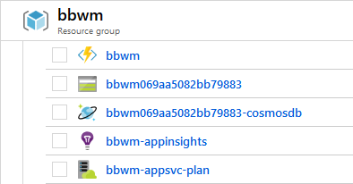

# Building environment

BBWM is an Azure Function App. The Azure Resources can be created using the Terraform scripts in the `build` directory and result in these


## Prepare Azure

Logon or Create a Service Principal as described in [Authenticating to Azure](https://www.terraform.io/docs/providers/azurerm/index.html#authenticating-to-azure).

It uses Azure back-end which you have to setup in advance. It requires a storage account and a blob container to hold Terraform state. See [azurerm Backend](https://www.terraform.io/docs/backends/types/azurerm.html).

## Alpha Vantage Key

Get a free key from [Alpha Vantage](https://www.alphavantage.co/). It is required by Terraform scripts to build the environment.

## Running Terraform

This sample Powershell code can be used to prepare for Terraform with a Service Principal.

```
$env:ARM_ACCESS_KEY = "******"
# Subscription ID (Visual Studio Enterprise (MVP))
$env:ARM_SUBSCRIPTION_ID = "******"
# Directory ID (MVP VSEnt Directory)
$env:ARM_TENANT_ID = "******"
# Application ID (terraform-fun)
$env:ARM_CLIENT_ID = "******"
# Key ELITEBOOK exp. 9/2/2021
$env:ARM_CLIENT_SECRET = "******"

# this is specific to BBWM project
$env:TF_VAR_alphavantage_apikey = "******"
```

Run `terraform init` and `terraform apply` as usual.

## Manual step

Create the `BBWM` Cosmo DB database in the instance produced by the Terraform script.