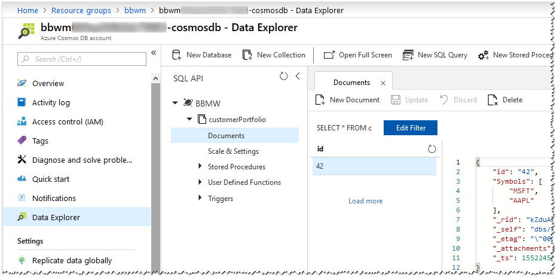

# API Configuration

The Function App settings must have the following three variables.

`Bbwm_AlphAvantage_ApiKey`
Get a free key from [Alpha Vantage](https://www.alphavantage.co/) and pass it to Terraform before building the environment.

`Bbwm_CosmosDb_PrimaryKey`
`Bbwm_CosmosDb_EndpointUri`
CosmoDB access: these variables are set by Terraform.

The API are authenticated using a key at application or function level.

## Data

## Health check

Get `/api/health/basic`, using a browser, Powershell or curl; it should returns HTTP 200 OK and the string `healthy`.
The `/api/health/dependencies` will check if the App can reach the dependent services.