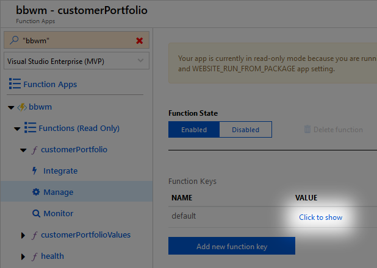

# API Usage

The API requires a function API key in the `code` parameter.



See [Authentication and Authorization](https://github.com/Azure/azure-functions-host/wiki/Http-Functions#authentication-and-authorization) for additional details.

## POST `/api/customerPortfolio/{customerId}`

Add a symbol to a customer portfolio, identified by customerId.

Sample POST Body data
`{"symbol": "MSFT"}`


## GET `/api/customerPortfolio/{customerId}`

Returns the current market values for the customer portfolio.

Sample Body response.
```
[
    {
        "symbol": "MSFT",
        "quote": 112.83,
        "failureReason": ""
    },
    {
        "symbol": "AAPL",
        "quote": 178.9,
        "failureReason": ""
    }
]
```

# API Design

The POST verb updates the document in CosmosDB identified by the customerId.

The GET verb retrieves the CosmosDB document identified by the customerId. It represents the customer portfolio and lists the stock symbols in the portfolio. The function will iterate through the list and invoke the Alpha Vantage service to retrieve the quote.